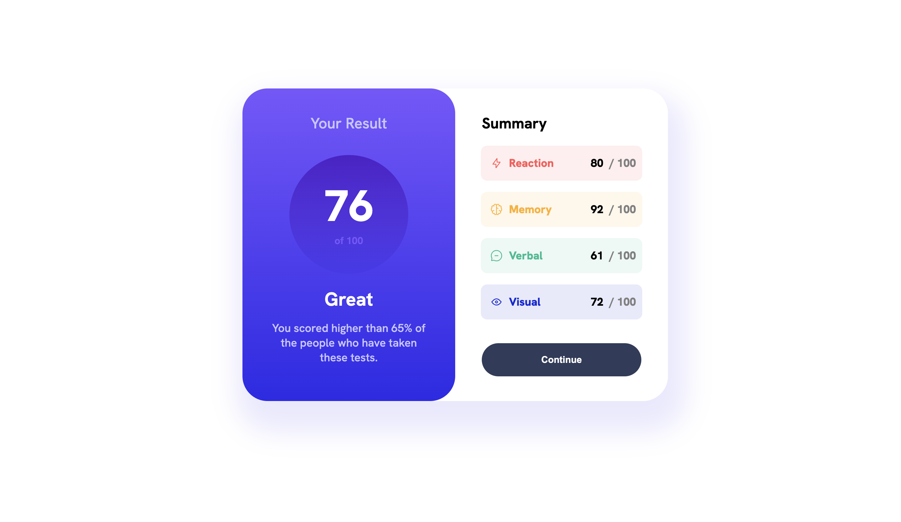
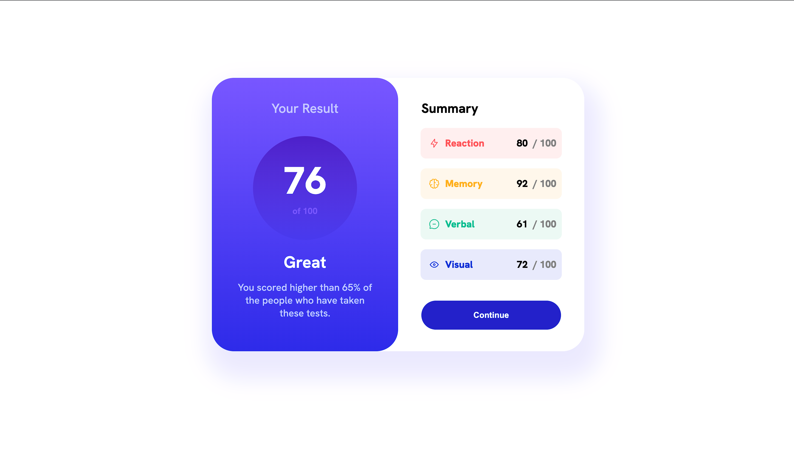
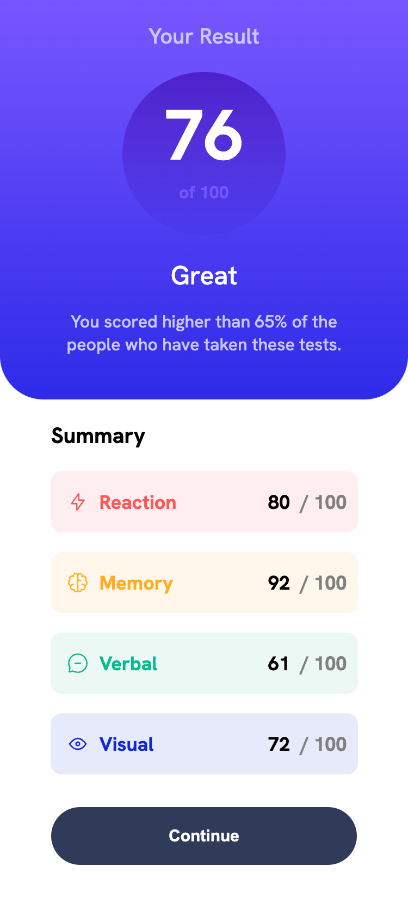
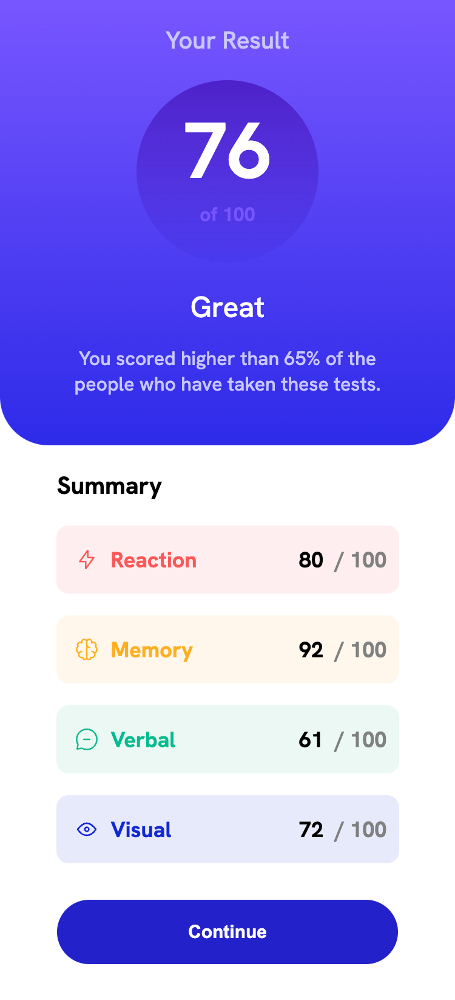

# Frontend Mentor - Results summary component solution

This is a solution to the [Results summary component challenge on Frontend Mentor](https://www.frontendmentor.io/challenges/results-summary-component-CE_K6s0maV). Frontend Mentor challenges help you improve your coding skills by building realistic projects. 

## Table of contents

- [Overview](#overview)
  - [The challenge](#the-challenge)
  - [Screenshots](#screenshot)
  - [My process](#my-process)
  - [Built with](#built-with)
  - [Useful resources](#useful-resources)
- [Author](#author)
- [Acknowledgments](#acknowledgments)

## Overview

After graduating Lighthouse Labs, I wanted to continue applying the skills I'd learned and
become more familiar with the interfaces people are using today. This was my first project on Front-End mentor.

### The challenge

Users should be able to:

- View the optimal layout for the interface depending on their device's screen size
- See hover and focus states for all interactive elements on the page
- **Bonus**: Use the local JSON data to dynamically populate the content

### Screenshots

# Desktop Design

# Desktop Design - Active

# Mobile Design

# Mobile Design - Active

## My process

I started with just the HTML and went with desktop first. Once I had a basic structure of the elements I added basic styles so that I could get everything spaced correctly. Got the fonts and colors sorted adjusting sizes where necessary. Added the media query to handle the mobile design and finished by testing and implementing some script in the HTML to create each of the scorebox elements on the summary page.

### Built with

- HTML5
- CSS custom properties
- Flexbox
- JavaScript
- GoogleFonts

### Useful resources

- [CSS Tricks for Flexbox](https://css-tricks.com/snippets/css/a-guide-to-flexbox/) - This is a great refernce when sorting out flexbox and ensuring you're usin align-items and justify-content correctly.

## Author

- Git Repository for the project: https://github.com/wfhopkins/results-summary-component
- LinkedIn Page for the Developer: https://www.linkedin.com/in/williamfhopkins/
- Frontend Mentor - [@yourusername](https://www.frontendmentor.io/profile/yourusername)

## Acknowledgments

Thanks to Jon Whipple(CDP) for help with a better approach to importing fonts and helpful
guidance when introducing the JavaScript to dynamically populate the values in the project.